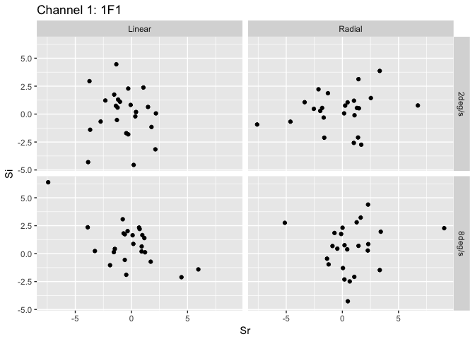
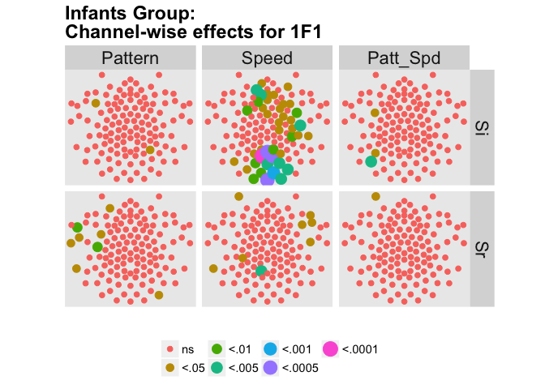

By Channel Across Participants
================
Rick Gilmore
2017-11-14 15:00:32

-   [Description](#description)
-   [Plots](#plots)
-   [ANOVA](#anova)
    -   [Sr summaries](#sr-summaries)
    -   [Si summaries](#si-summaries)
    -   [Topo plot](#topo-plot)
    -   [Mean amplitude plots of 1F1 channels meeting p&lt; .01 for Infants participants.](#mean-amplitude-plots-of-1f1-channels-meeting-p-.01-for-infants-participants.)

Description
-----------

This document produces scatter plots of the real and imaginary SSVEP components at the harmonic given by the YAML parameter, `params$harmonic`, for all 128 channels. The default harmonic value is 1F1.

Plots
-----

ANOVA
-----

### Sr summaries

### Si summaries

### Topo plot

    ##          F-Pattern  F-Speed F-Patt*Spd df-Pattern df-Speed df-Patt*Spd
    ## new_vals  2.241205 2.429229  0.2493964          1        1           1
    ##          df-Pattern-denom df-Speed-denom df-Patt*Spd-denom p-Pattern
    ## new_vals               91             91                91 0.1378368
    ##            p-Speed p-Patt*Spd
    ## new_vals 0.1225627  0.6187057

Prepare to plot topo plot

    ##     Chan     Cond        Fvals FdfNum FdfDen        Pvals        xpos
    ## 1      1  Pattern 1.249220e-02      1     91 9.112531e-01  2.7061e-01
    ## 2      2  Pattern 5.973290e-01      1     91 4.416018e-01  1.8883e-01
    ## 3      3  Pattern 7.578273e-03      1     91 9.308204e-01  1.1004e-01
    ## 4      4  Pattern 4.341054e-01      1     91 5.116451e-01  7.3707e-02
    ## 5      5  Pattern 3.680252e-01      1     91 5.455932e-01  3.5595e-02
    ## 6      6  Pattern 1.266793e+00      1     91 2.633288e-01 -2.1870e-17
    ## 7      7  Pattern 9.781183e-01      1     91 3.252862e-01 -2.8292e-02
    ## 8      8  Pattern 9.499919e-01      1     91 3.323052e-01  1.5945e-01
    ## 9      9  Pattern 9.341501e-01      1     91 3.363485e-01  8.3862e-02
    ## 10    10  Pattern 4.663423e-02      1     91 8.295104e-01  5.0145e-02
    ## 11    11  Pattern 9.226784e-01      1     91 3.393180e-01 -4.8953e-17
    ## 12    12  Pattern 1.395958e+00      1     91 2.404800e-01 -3.5595e-02
    ## 13    13  Pattern 6.986353e-01      1     91 4.054320e-01 -5.8411e-02
    ## 14    14  Pattern 3.137297e-01      1     91 5.767768e-01  4.4058e-02
    ## 15    15  Pattern 1.143499e-01      1     91 7.360241e-01 -6.9342e-17
    ## 16    16  Pattern 7.803879e-03      1     91 9.298009e-01 -6.0391e-17
    ## 17    17  Pattern 4.365223e-02      1     91 8.349690e-01 -8.7824e-17
    ## 18    18  Pattern 2.190452e-01      1     91 6.408874e-01 -5.0145e-02
    ## 19    19  Pattern 1.674910e+00      1     91 1.988769e-01 -7.3707e-02
    ## 20    20  Pattern 1.308538e+00      1     91 2.556596e-01 -9.7709e-02
    ## 21    21  Pattern 7.965504e-02      1     91 7.784063e-01 -4.4058e-02
    ## 22    22  Pattern 4.415084e-01      1     91 5.080756e-01 -8.3862e-02
    ## 23    23  Pattern 1.590535e+00      1     91 2.104733e-01 -1.1004e-01
    ## 24    24  Pattern 2.828021e+00      1     91 9.606135e-02 -1.2335e-01
    ## 25    25  Pattern 7.231918e-02      1     91 7.885983e-01 -1.5945e-01
    ## 26    26  Pattern 2.847343e-01      1     91 5.949159e-01 -1.8883e-01
    ## 27    27  Pattern 2.021810e+00      1     91 1.584726e-01 -1.7560e-01
    ## 28    28  Pattern 2.994147e+00      1     91 8.695583e-02 -1.5612e-01
    ## 29    29  Pattern 3.308462e+00      1     91 7.221311e-02 -1.2367e-01
    ## 30    30  Pattern 4.146685e-01      1     91 5.212292e-01 -8.9234e-02
    ## 31    31  Pattern 2.220955e+00      1     91 1.396069e-01 -4.4495e-02
    ## 32    32  Pattern 2.514972e-01      1     91 6.172339e-01 -2.7061e-01
    ## 33    33  Pattern 4.011983e+00      1     91 4.815337e-02 -2.7006e-01
    ## 34    34  Pattern 1.731427e+00      1     91 1.915341e-01 -2.2865e-01
    ## 35    35  Pattern 2.997915e+00      1     91 8.676062e-02 -1.8320e-01
    ## 36    36  Pattern 2.610561e+00      1     91 1.096161e-01 -1.4086e-01
    ## 37    37  Pattern 7.538311e-01      1     91 3.875500e-01 -9.1723e-02
    ## 38    38  Pattern 1.189883e+00      1     91 2.782330e-01 -3.4659e-01
    ## 39    39  Pattern 3.020271e+00      1     91 8.561253e-02 -3.3383e-01
    ## 40    40  Pattern 2.098358e-01      1     91 6.479882e-01 -2.5598e-01
    ## 41    41  Pattern 5.026073e-01      1     91 4.801691e-01 -1.9461e-01
    ## 42    42  Pattern 2.973719e-01      1     91 5.868689e-01 -1.5112e-01
    ## 43    43  Pattern 1.793104e+00      1     91 1.838837e-01 -4.1311e-01
    ## 44    44  Pattern 1.417053e+00      1     91 2.369853e-01 -3.9898e-01
    ## 45    45  Pattern 5.138951e-03      1     91 9.430087e-01 -3.1837e-01
    ## 46    46  Pattern 5.212775e-01      1     91 4.721484e-01 -2.4052e-01
    ## 47    47  Pattern 1.488445e-01      1     91 7.005425e-01 -1.9145e-01
    ## 48    48  Pattern 3.126532e+00      1     91 8.037879e-02 -4.5895e-01
    ## 49    49  Pattern 1.557720e+00      1     91 2.152012e-01 -4.6317e-01
    ## 50    50  Pattern 3.410278e-01      1     91 5.606814e-01 -2.7341e-01
    ## 51    51  Pattern 1.058575e+00      1     91 3.062674e-01 -2.0096e-01
    ## 52    52  Pattern 3.381358e-01      1     91 5.623449e-01 -1.5394e-01
    ## 53    53  Pattern 5.411594e-02      1     91 8.165724e-01 -9.9452e-02
    ## 54    54  Pattern 4.149180e-01      1     91 5.211041e-01 -5.0987e-02
    ## 55    55  Pattern 6.615233e-02      1     91 7.976043e-01  5.8045e-18
    ## 56    56  Pattern 1.193798e-01      1     91 7.305055e-01 -4.1976e-01
    ## 57    57  Pattern 1.045867e+00      1     91 3.091719e-01 -3.3631e-01
    ## 58    58  Pattern 2.469959e+00      1     91 1.195116e-01 -2.2492e-01
    ## 59    59  Pattern 2.521041e+00      1     91 1.158051e-01 -1.5297e-01
    ## 60    60  Pattern 3.648690e+00      1     91 5.926257e-02 -1.0478e-01
    ## 61    61  Pattern 5.335446e-01      1     91 4.669968e-01 -5.4807e-02
    ## 62    62  Pattern 2.568457e-01      1     91 6.135214e-01  1.1987e-17
    ## 63    63  Pattern 1.063291e+00      1     91 3.051987e-01 -3.4900e-01
    ## 64    64  Pattern 1.668524e+00      1     91 1.997274e-01 -2.5813e-01
    ## 65    65  Pattern 8.202460e-01      1     91 3.675000e-01 -1.6624e-01
    ## 66    66  Pattern 2.328083e+00      1     91 1.305265e-01 -1.0296e-01
    ## 67    67  Pattern 2.956904e+00      1     91 8.891110e-02 -4.6760e-02
    ## 68    68  Pattern 3.660684e-01      1     91 5.466610e-01 -2.2108e-01
    ## 69    69  Pattern 1.455820e+00      1     91 2.307237e-01 -1.5850e-01
    ## 70    70  Pattern 3.336186e+00      1     91 7.105032e-02 -9.3018e-02
    ## 71    71  Pattern 2.545447e+00      1     91 1.140799e-01 -3.9316e-02
    ## 72    72  Pattern 1.101465e+00      1     91 2.967242e-01  2.5091e-17
    ## 73    73  Pattern 7.243195e-01      1     91 3.969647e-01 -1.0679e-01
    ## 74    74  Pattern 6.385218e-01      1     91 4.263273e-01 -4.9033e-02
    ## 75    75  Pattern 1.816250e+00      1     91 1.811060e-01  3.6897e-17
    ## 76    76  Pattern 7.072416e-01      1     91 4.025655e-01  3.9316e-02
    ## 77    77  Pattern 7.931159e-01      1     91 3.755081e-01  4.6760e-02
    ## 78    78  Pattern 2.087411e+00      1     91 1.519522e-01  5.4807e-02
    ## 79    79  Pattern 1.668027e+00      1     91 1.997938e-01  5.0987e-02
    ## 80    80  Pattern 8.647193e-01      1     91 3.548816e-01  4.4495e-02
    ## 81    81  Pattern 2.635774e-02      1     91 8.713897e-01  5.1880e-17
    ## 82    82  Pattern 1.680344e-01      1     91 6.828281e-01  4.9033e-02
    ## 83    83  Pattern 9.484816e-01      1     91 3.326878e-01  9.3018e-02
    ## 84    84  Pattern 5.811765e-01      1     91 4.478230e-01  1.0296e-01
    ## 85    85  Pattern 3.299716e+00      1     91 7.258419e-02  1.0478e-01
    ## 86    86  Pattern 2.802543e+00      1     91 9.754883e-02  9.9452e-02
    ## 87    87  Pattern 3.648193e-02      1     91 8.489492e-01  9.1723e-02
    ## 88    88  Pattern 8.629077e-03      1     91 9.261929e-01  1.0679e-01
    ## 89    89  Pattern 8.609713e-01      1     91 3.559216e-01  1.5850e-01
    ## 90    90  Pattern 1.456683e+00      1     91 2.305866e-01  1.6624e-01
    ## 91    91  Pattern 4.831469e+00      1     91 3.048213e-02  1.5297e-01
    ## 92    92  Pattern 2.341637e+00      1     91 1.294261e-01  1.5394e-01
    ## 93    93  Pattern 1.954760e-02      1     91 8.891169e-01  1.5112e-01
    ## 94    94  Pattern 4.991023e-02      1     91 8.237203e-01  2.2108e-01
    ## 95    95  Pattern 9.436568e-01      1     91 3.339142e-01  2.5813e-01
    ## 96    96  Pattern 1.748366e+00      1     91 1.893962e-01  2.2492e-01
    ## 97    97  Pattern 2.410960e-01      1     91 6.245977e-01  2.0096e-01
    ## 98    98  Pattern 7.834659e-02      1     91 7.801860e-01  1.9145e-01
    ## 99    99  Pattern 1.157486e+00      1     91 2.848316e-01  3.4900e-01
    ## 100  100  Pattern 3.343743e-01      1     91 5.645230e-01  3.3631e-01
    ## 101  101  Pattern 2.487962e-01      1     91 6.191276e-01  2.7341e-01
    ## 102  102  Pattern 1.102575e-02      1     91 9.166041e-01  2.4052e-01
    ## 103  103  Pattern 6.434529e-03      1     91 9.362420e-01  1.9461e-01
    ## 104  104  Pattern 1.013428e+00      1     91 3.167523e-01  1.4086e-01
    ## 105  105  Pattern 4.812385e-01      1     91 4.896289e-01  8.9234e-02
    ## 106  106  Pattern 4.399700e-01      1     91 5.088138e-01  2.8292e-02
    ## 107  107  Pattern 1.145538e-01      1     91 7.357977e-01  4.1976e-01
    ## 108  108  Pattern 8.832214e-01      1     91 3.498088e-01  3.1837e-01
    ## 109  109  Pattern 9.502254e-02      1     91 7.585911e-01  2.5598e-01
    ## 110  110  Pattern 3.496637e-05      1     91 9.952949e-01  1.8320e-01
    ## 111  111  Pattern 2.399687e-04      1     91 9.876744e-01  1.2367e-01
    ## 112  112  Pattern 4.859894e-01      1     91 4.874990e-01  5.8411e-02
    ## 113  113  Pattern 2.776493e+00      1     91 9.909611e-02  4.6317e-01
    ## 114  114  Pattern 3.141807e-02      1     91 8.597048e-01  3.9898e-01
    ## 115  115  Pattern 4.722731e-01      1     91 4.936910e-01  3.3383e-01
    ## 116  116  Pattern 3.094646e-03      1     91 9.557589e-01  2.2865e-01
    ## 117  117  Pattern 2.096898e-01      1     91 6.481022e-01  1.5612e-01
    ## 118  118  Pattern 7.158096e-03      1     91 9.327609e-01  9.7709e-02
    ## 119  119  Pattern 4.118654e-01      1     91 5.226375e-01  4.5895e-01
    ## 120  120  Pattern 7.304325e-01      1     91 3.949875e-01  4.1311e-01
    ## 121  121  Pattern 1.819578e+00      1     91 1.807106e-01  3.4659e-01
    ## 122  122  Pattern 7.070851e-01      1     91 4.026173e-01  2.7006e-01
    ## 123  123  Pattern 1.466117e+00      1     91 2.290947e-01  1.7560e-01
    ## 124  124  Pattern 1.722126e-02      1     91 8.958832e-01  1.2335e-01
    ## 125  125  Pattern 9.672921e-02      1     91 7.565019e-01  3.3480e-01
    ## 126  126  Pattern 9.124904e-01      1     91 3.419852e-01  2.2208e-01
    ## 127  127  Pattern 1.116040e+00      1     91 2.935693e-01 -2.2208e-01
    ## 128  128  Pattern 2.392079e+00      1     91 1.254221e-01 -3.3480e-01
    ## 129    1    Speed 1.631357e+00      1     91 2.047647e-01  2.7061e-01
    ## 130    2    Speed 1.767647e+00      1     91 1.869969e-01  1.8883e-01
    ## 131    3    Speed 1.324986e+00      1     91 2.527148e-01  1.1004e-01
    ## 132    4    Speed 2.111351e+00      1     91 1.496500e-01  7.3707e-02
    ## 133    5    Speed 3.790808e+00      1     91 5.461844e-02  3.5595e-02
    ## 134    6    Speed 5.721983e+00      1     91 1.881061e-02 -2.1870e-17
    ## 135    7    Speed 3.827087e+00      1     91 5.349692e-02 -2.8292e-02
    ## 136    8    Speed 4.383365e+00      1     91 3.907276e-02  1.5945e-01
    ## 137    9    Speed 6.848323e-01      1     91 4.100926e-01  8.3862e-02
    ## 138   10    Speed 4.490209e+00      1     91 3.681337e-02  5.0145e-02
    ## 139   11    Speed 3.983735e+00      1     91 4.893116e-02 -4.8953e-17
    ## 140   12    Speed 4.020698e+00      1     91 4.791609e-02 -3.5595e-02
    ## 141   13    Speed 6.070099e-01      1     91 4.379373e-01 -5.8411e-02
    ## 142   14    Speed 3.558827e+00      1     91 6.241833e-02  4.4058e-02
    ## 143   15    Speed 2.107337e+00      1     91 1.500331e-01 -6.9342e-17
    ## 144   16    Speed 4.612732e+00      1     91 3.439266e-02 -6.0391e-17
    ## 145   17    Speed 3.126935e+00      1     91 8.035963e-02 -8.7824e-17
    ## 146   18    Speed 9.048024e+00      1     91 3.400484e-03 -5.0145e-02
    ## 147   19    Speed 7.126550e+00      1     91 8.994585e-03 -7.3707e-02
    ## 148   20    Speed 2.661671e+00      1     91 1.062488e-01 -9.7709e-02
    ## 149   21    Speed 4.237813e+00      1     91 4.239192e-02 -4.4058e-02
    ## 150   22    Speed 9.091609e+00      1     91 3.327669e-03 -8.3862e-02
    ## 151   23    Speed 2.596194e+00      1     91 1.105840e-01 -1.1004e-01
    ## 152   24    Speed 3.095638e+00      1     91 8.186330e-02 -1.2335e-01
    ## 153   25    Speed 1.010014e+00      1     91 3.175643e-01 -1.5945e-01
    ## 154   26    Speed 2.466940e+00      1     91 1.197348e-01 -1.8883e-01
    ## 155   27    Speed 2.039185e+00      1     91 1.567147e-01 -1.7560e-01
    ## 156   28    Speed 7.089504e+00      1     91 9.168396e-03 -1.5612e-01
    ## 157   29    Speed 1.195212e+00      1     91 2.771664e-01 -1.2367e-01
    ## 158   30    Speed 2.992496e+00      1     91 8.704147e-02 -8.9234e-02
    ## 159   31    Speed 1.197573e+00      1     91 2.766955e-01 -4.4495e-02
    ## 160   32    Speed 3.960717e-02      1     91 8.426946e-01 -2.7061e-01
    ## 161   33    Speed 1.742858e-02      1     91 8.952620e-01 -2.7006e-01
    ## 162   34    Speed 6.109230e-01      1     91 4.364694e-01 -2.2865e-01
    ## 163   35    Speed 7.083425e-01      1     91 4.022009e-01 -1.8320e-01
    ## 164   36    Speed 1.351879e-01      1     91 7.139664e-01 -1.4086e-01
    ## 165   37    Speed 1.328320e+00      1     91 2.521230e-01 -9.1723e-02
    ## 166   38    Speed 8.888530e-02      1     91 7.662787e-01 -3.4659e-01
    ## 167   39    Speed 5.699255e-02      1     91 8.118509e-01 -3.3383e-01
    ## 168   40    Speed 2.425239e-01      1     91 6.235752e-01 -2.5598e-01
    ## 169   41    Speed 7.284636e-01      1     91 3.956227e-01 -1.9461e-01
    ## 170   42    Speed 8.505372e-01      1     91 3.588391e-01 -1.5112e-01
    ## 171   43    Speed 1.310954e-03      1     91 9.711965e-01 -4.1311e-01
    ## 172   44    Speed 3.768474e-01      1     91 5.408269e-01 -3.9898e-01
    ## 173   45    Speed 1.743156e+00      1     91 1.900506e-01 -3.1837e-01
    ## 174   46    Speed 2.173310e-01      1     91 6.421951e-01 -2.4052e-01
    ## 175   47    Speed 6.837819e-01      1     91 4.104505e-01 -1.9145e-01
    ## 176   48    Speed 4.445299e-01      1     91 5.066311e-01 -4.5895e-01
    ## 177   49    Speed 2.538769e-01      1     91 6.155760e-01 -4.6317e-01
    ## 178   50    Speed 1.500574e-01      1     91 6.993850e-01 -2.7341e-01
    ## 179   51    Speed 5.687968e-01      1     91 4.526846e-01 -2.0096e-01
    ## 180   52    Speed 5.497851e-02      1     91 8.151430e-01 -1.5394e-01
    ## 181   53    Speed 2.882448e+00      1     91 9.296715e-02 -9.9452e-02
    ## 182   54    Speed 3.049070e-01      1     91 5.821760e-01 -5.0987e-02
    ## 183   55    Speed 1.396556e-02      1     91 9.061887e-01  5.8045e-18
    ## 184   56    Speed 1.539553e+00      1     91 2.178737e-01 -4.1976e-01
    ## 185   57    Speed 2.720994e-01      1     91 6.031942e-01 -3.3631e-01
    ## 186   58    Speed 3.650464e-05      1     91 9.951925e-01 -2.2492e-01
    ## 187   59    Speed 1.423032e-02      1     91 9.053078e-01 -1.5297e-01
    ## 188   60    Speed 3.208676e+00      1     91 7.657327e-02 -1.0478e-01
    ## 189   61    Speed 1.056035e+00      1     91 3.068450e-01 -5.4807e-02
    ## 190   62    Speed 2.987905e+00      1     91 8.728018e-02  1.1987e-17
    ## 191   63    Speed 1.077108e+00      1     91 3.020953e-01 -3.4900e-01
    ## 192   64    Speed 5.435259e+00      1     91 2.194247e-02 -2.5813e-01
    ## 193   65    Speed 3.112771e+00      1     91 8.103636e-02 -1.6624e-01
    ## 194   66    Speed 6.095783e+00      1     91 1.541730e-02 -1.0296e-01
    ## 195   67    Speed 6.818828e+00      1     91 1.054974e-02 -4.6760e-02
    ## 196   68    Speed 1.689630e+00      1     91 1.969327e-01 -2.2108e-01
    ## 197   69    Speed 6.487769e+00      1     91 1.254057e-02 -1.5850e-01
    ## 198   70    Speed 8.039081e+00      1     91 5.640549e-03 -9.3018e-02
    ## 199   71    Speed 1.678000e+01      1     91 9.089581e-05 -3.9316e-02
    ## 200   72    Speed 1.456181e+01      1     91 2.470143e-04  2.5091e-17
    ## 201   73    Speed 7.582200e+00      1     91 7.116995e-03 -1.0679e-01
    ## 202   74    Speed 7.356977e+00      1     91 7.987883e-03 -4.9033e-02
    ## 203   75    Speed 9.991936e+00      1     91 2.135817e-03  3.6897e-17
    ## 204   76    Speed 1.646887e+01      1     91 1.044061e-04  3.9316e-02
    ## 205   77    Speed 7.636048e+00      1     91 6.923818e-03  4.6760e-02
    ## 206   78    Speed 1.536219e+00      1     91 2.183685e-01  5.4807e-02
    ## 207   79    Speed 6.144816e-01      1     91 4.351410e-01  5.0987e-02
    ## 208   80    Speed 8.734094e-02      1     91 7.682585e-01  4.4495e-02
    ## 209   81    Speed 1.458780e+01      1     91 2.440976e-04  5.1880e-17
    ## 210   82    Speed 1.258439e+01      1     91 6.172972e-04  4.9033e-02
    ## 211   83    Speed 9.470696e+00      1     91 2.758579e-03  9.3018e-02
    ## 212   84    Speed 5.575964e+00      1     91 2.034205e-02  1.0296e-01
    ## 213   85    Speed 1.830321e+00      1     91 1.794414e-01  1.0478e-01
    ## 214   86    Speed 8.322992e-01      1     91 3.640191e-01  9.9452e-02
    ## 215   87    Speed 5.201412e+00      1     91 2.490319e-02  9.1723e-02
    ## 216   88    Speed 8.704583e+00      1     91 4.035344e-03  1.0679e-01
    ## 217   89    Speed 9.733717e+00      1     91 2.423754e-03  1.5850e-01
    ## 218   90    Speed 2.006973e+00      1     91 1.599917e-01  1.6624e-01
    ## 219   91    Speed 1.622174e+00      1     91 2.060325e-01  1.5297e-01
    ## 220   92    Speed 8.474279e-01      1     91 3.597149e-01  1.5394e-01
    ## 221   93    Speed 1.240432e+00      1     91 2.683210e-01  1.5112e-01
    ## 222   94    Speed 2.932061e+00      1     91 9.024233e-02  2.2108e-01
    ## 223   95    Speed 1.997619e+00      1     91 1.609581e-01  2.5813e-01
    ## 224   96    Speed 7.191241e-01      1     91 3.986564e-01  2.2492e-01
    ## 225   97    Speed 1.728948e+00      1     91 1.918494e-01  2.0096e-01
    ## 226   98    Speed 7.467645e+00      1     91 7.546864e-03  1.9145e-01
    ## 227   99    Speed 3.284682e-03      1     91 9.544222e-01  3.4900e-01
    ## 228  100    Speed 3.332827e-01      1     91 5.651580e-01  3.3631e-01
    ## 229  101    Speed 1.163915e+00      1     91 2.835064e-01  2.7341e-01
    ## 230  102    Speed 4.367548e+00      1     91 3.941961e-02  2.4052e-01
    ## 231  103    Speed 3.948883e+00      1     91 4.990944e-02  1.9461e-01
    ## 232  104    Speed 2.897363e+00      1     91 9.213855e-02  1.4086e-01
    ## 233  105    Speed 6.046724e+00      1     91 1.582332e-02  8.9234e-02
    ## 234  106    Speed 4.527742e-01      1     91 5.027257e-01  2.8292e-02
    ## 235  107    Speed 8.353598e-03      1     91 9.273772e-01  4.1976e-01
    ## 236  108    Speed 4.087352e+00      1     91 4.614235e-02  3.1837e-01
    ## 237  109    Speed 1.044709e+01      1     91 1.711305e-03  2.5598e-01
    ## 238  110    Speed 4.368560e+00      1     91 3.939732e-02  1.8320e-01
    ## 239  111    Speed 6.718323e+00      1     91 1.111657e-02  1.2367e-01
    ## 240  112    Speed 2.794559e+00      1     91 9.802020e-02  5.8411e-02
    ## 241  113    Speed 6.566053e-01      1     91 4.198750e-01  4.6317e-01
    ## 242  114    Speed 6.913899e-03      1     91 9.339150e-01  3.9898e-01
    ## 243  115    Speed 1.029121e+00      1     91 3.130548e-01  3.3383e-01
    ## 244  116    Speed 7.242587e+00      1     91 8.472064e-03  2.2865e-01
    ## 245  117    Speed 3.391077e+00      1     91 6.880784e-02  1.5612e-01
    ## 246  118    Speed 4.302141e+00      1     91 4.088927e-02  9.7709e-02
    ## 247  119    Speed 5.600042e-03      1     91 9.405115e-01  4.5895e-01
    ## 248  120    Speed 3.346286e-01      1     91 5.643752e-01  4.1311e-01
    ## 249  121    Speed 3.169977e-01      1     91 5.748022e-01  3.4659e-01
    ## 250  122    Speed 1.713207e+00      1     91 1.938656e-01  2.7006e-01
    ## 251  123    Speed 6.429533e+00      1     91 1.292964e-02  1.7560e-01
    ## 252  124    Speed 5.445426e+00      1     91 2.182249e-02  1.2335e-01
    ## 253  125    Speed 1.202190e+00      1     91 2.757776e-01  3.3480e-01
    ## 254  126    Speed 1.637820e-01      1     91 6.866478e-01  2.2208e-01
    ## 255  127    Speed 1.144359e+00      1     91 2.875625e-01 -2.2208e-01
    ## 256  128    Speed 1.216280e-03      1     91 9.722556e-01 -3.3480e-01
    ## 257    1 Patt_Spd 7.607923e-01      1     91 3.853763e-01  2.7061e-01
    ## 258    2 Patt_Spd 9.238976e-02      1     91 7.618547e-01  1.8883e-01
    ## 259    3 Patt_Spd 1.178905e+00      1     91 2.804470e-01  1.1004e-01
    ## 260    4 Patt_Spd 7.639990e-03      1     91 9.305400e-01  7.3707e-02
    ## 261    5 Patt_Spd 2.956105e-01      1     91 5.879770e-01  3.5595e-02
    ## 262    6 Patt_Spd 3.005095e-02      1     91 8.627597e-01 -2.1870e-17
    ## 263    7 Patt_Spd 8.247335e-01      1     91 3.661986e-01 -2.8292e-02
    ## 264    8 Patt_Spd 6.082482e-01      1     91 4.374719e-01  1.5945e-01
    ## 265    9 Patt_Spd 3.575649e+00      1     91 6.181400e-02  8.3862e-02
    ## 266   10 Patt_Spd 1.465617e-01      1     91 7.027358e-01  5.0145e-02
    ## 267   11 Patt_Spd 3.239542e-01      1     91 5.706432e-01 -4.8953e-17
    ## 268   12 Patt_Spd 4.636070e-01      1     91 4.976720e-01 -3.5595e-02
    ## 269   13 Patt_Spd 8.879423e-02      1     91 7.663950e-01 -5.8411e-02
    ## 270   14 Patt_Spd 9.329381e-04      1     91 9.757001e-01  4.4058e-02
    ## 271   15 Patt_Spd 1.614409e+00      1     91 2.071120e-01 -6.9342e-17
    ## 272   16 Patt_Spd 8.967717e-01      1     91 3.461567e-01 -6.0391e-17
    ## 273   17 Patt_Spd 8.915107e-01      1     91 3.475684e-01 -8.7824e-17
    ## 274   18 Patt_Spd 7.458328e-01      1     91 3.900694e-01 -5.0145e-02
    ## 275   19 Patt_Spd 8.247911e-01      1     91 3.661819e-01 -7.3707e-02
    ## 276   20 Patt_Spd 1.959559e-01      1     91 6.590556e-01 -9.7709e-02
    ## 277   21 Patt_Spd 5.375359e-02      1     91 8.171765e-01 -4.4058e-02
    ## 278   22 Patt_Spd 6.289650e-02      1     91 8.025405e-01 -8.3862e-02
    ## 279   23 Patt_Spd 2.824254e-01      1     91 5.964108e-01 -1.1004e-01
    ## 280   24 Patt_Spd 7.600995e-02      1     91 7.834043e-01 -1.2335e-01
    ## 281   25 Patt_Spd 2.788899e+00      1     91 9.835588e-02 -1.5945e-01
    ## 282   26 Patt_Spd 4.022050e-01      1     91 5.275437e-01 -1.8883e-01
    ## 283   27 Patt_Spd 1.944628e-01      1     91 6.602739e-01 -1.7560e-01
    ## 284   28 Patt_Spd 2.209538e+00      1     91 1.406163e-01 -1.5612e-01
    ## 285   29 Patt_Spd 3.677361e-01      1     91 5.457507e-01 -1.2367e-01
    ## 286   30 Patt_Spd 1.680790e+00      1     91 1.980976e-01 -8.9234e-02
    ## 287   31 Patt_Spd 1.528594e+00      1     91 2.195052e-01 -4.4495e-02
    ## 288   32 Patt_Spd 1.135645e+00      1     91 2.893938e-01 -2.7061e-01
    ## 289   33 Patt_Spd 2.581468e+00      1     91 1.115859e-01 -2.7006e-01
    ## 290   34 Patt_Spd 4.596673e+00      1     91 3.470005e-02 -2.2865e-01
    ## 291   35 Patt_Spd 1.777138e+00      1     91 1.858290e-01 -1.8320e-01
    ## 292   36 Patt_Spd 1.997138e+00      1     91 1.610080e-01 -1.4086e-01
    ## 293   37 Patt_Spd 8.940684e-01      1     91 3.468811e-01 -9.1723e-02
    ## 294   38 Patt_Spd 8.615724e-01      1     91 3.557546e-01 -3.4659e-01
    ## 295   39 Patt_Spd 3.751577e+00      1     91 5.585983e-02 -3.3383e-01
    ## 296   40 Patt_Spd 3.460072e+00      1     91 6.609773e-02 -2.5598e-01
    ## 297   41 Patt_Spd 5.596183e-01      1     91 4.563431e-01 -1.9461e-01
    ## 298   42 Patt_Spd 1.896882e+00      1     91 1.718061e-01 -1.5112e-01
    ## 299   43 Patt_Spd 3.720504e+00      1     91 5.686471e-02 -4.1311e-01
    ## 300   44 Patt_Spd 9.341836e-01      1     91 3.363399e-01 -3.9898e-01
    ## 301   45 Patt_Spd 1.418102e+00      1     91 2.368130e-01 -3.1837e-01
    ## 302   46 Patt_Spd 3.680334e-03      1     91 9.517584e-01 -2.4052e-01
    ## 303   47 Patt_Spd 2.326859e-01      1     91 6.306977e-01 -1.9145e-01
    ## 304   48 Patt_Spd 3.627955e+00      1     91 5.997510e-02 -4.5895e-01
    ## 305   49 Patt_Spd 2.257921e+00      1     91 1.363948e-01 -4.6317e-01
    ## 306   50 Patt_Spd 8.053750e-01      1     91 3.718593e-01 -2.7341e-01
    ## 307   51 Patt_Spd 1.749286e+00      1     91 1.892809e-01 -2.0096e-01
    ## 308   52 Patt_Spd 1.125265e-01      1     91 7.380580e-01 -1.5394e-01
    ## 309   53 Patt_Spd 3.480298e-02      1     91 8.524244e-01 -9.9452e-02
    ## 310   54 Patt_Spd 1.185336e+00      1     91 2.791473e-01 -5.0987e-02
    ## 311   55 Patt_Spd 4.087936e-01      1     91 5.241887e-01  5.8045e-18
    ## 312   56 Patt_Spd 1.304816e+00      1     91 2.563320e-01 -4.1976e-01
    ## 313   57 Patt_Spd 1.199162e+00      1     91 2.763791e-01 -3.3631e-01
    ## 314   58 Patt_Spd 4.977927e+00      1     91 2.812959e-02 -2.2492e-01
    ## 315   59 Patt_Spd 2.561679e+00      1     91 1.129484e-01 -1.5297e-01
    ## 316   60 Patt_Spd 3.942443e+00      1     91 5.009251e-02 -1.0478e-01
    ## 317   61 Patt_Spd 1.127686e-01      1     91 7.377868e-01 -5.4807e-02
    ## 318   62 Patt_Spd 2.204552e-01      1     91 6.398164e-01  1.1987e-17
    ## 319   63 Patt_Spd 3.790300e+00      1     91 5.463434e-02 -3.4900e-01
    ## 320   64 Patt_Spd 1.057177e+01      1     91 1.610975e-03 -2.5813e-01
    ## 321   65 Patt_Spd 1.607754e+00      1     91 2.080425e-01 -1.6624e-01
    ## 322   66 Patt_Spd 1.890718e+00      1     91 1.724970e-01 -1.0296e-01
    ## 323   67 Patt_Spd 7.548929e-01      1     91 3.872173e-01 -4.6760e-02
    ## 324   68 Patt_Spd 2.207082e+00      1     91 1.408345e-01 -2.2108e-01
    ## 325   69 Patt_Spd 2.168891e+00      1     91 1.442782e-01 -1.5850e-01
    ## 326   70 Patt_Spd 3.778185e+00      1     91 5.501459e-02 -9.3018e-02
    ## 327   71 Patt_Spd 3.879773e-01      1     91 5.349224e-01 -3.9316e-02
    ## 328   72 Patt_Spd 9.916412e-02      1     91 7.535560e-01  2.5091e-17
    ## 329   73 Patt_Spd 5.992332e-01      1     91 4.408772e-01 -1.0679e-01
    ## 330   74 Patt_Spd 1.201953e-01      1     91 7.296231e-01 -4.9033e-02
    ## 331   75 Patt_Spd 4.305186e-01      1     91 5.133902e-01  3.6897e-17
    ## 332   76 Patt_Spd 2.451493e-02      1     91 8.759287e-01  3.9316e-02
    ## 333   77 Patt_Spd 1.784726e-01      1     91 6.736857e-01  4.6760e-02
    ## 334   78 Patt_Spd 2.805260e-01      1     91 5.976465e-01  5.4807e-02
    ## 335   79 Patt_Spd 1.384964e+00      1     91 2.423266e-01  5.0987e-02
    ## 336   80 Patt_Spd 2.109202e+00      1     91 1.498550e-01  4.4495e-02
    ## 337   81 Patt_Spd 2.941996e-03      1     91 9.568627e-01  5.1880e-17
    ## 338   82 Patt_Spd 1.843505e-03      1     91 9.658466e-01  4.9033e-02
    ## 339   83 Patt_Spd 8.867081e-03      1     91 9.251850e-01  9.3018e-02
    ## 340   84 Patt_Spd 2.557274e-01      1     91 6.142935e-01  1.0296e-01
    ## 341   85 Patt_Spd 1.361056e+00      1     91 2.464028e-01  1.0478e-01
    ## 342   86 Patt_Spd 5.904659e-01      1     91 4.442286e-01  9.9452e-02
    ## 343   87 Patt_Spd 3.214669e+00      1     91 7.630340e-02  9.1723e-02
    ## 344   88 Patt_Spd 1.773646e-01      1     91 6.746410e-01  1.0679e-01
    ## 345   89 Patt_Spd 1.422181e+00      1     91 2.361451e-01  1.5850e-01
    ## 346   90 Patt_Spd 1.010157e-03      1     91 9.747147e-01  1.6624e-01
    ## 347   91 Patt_Spd 5.076499e-01      1     91 4.779809e-01  1.5297e-01
    ## 348   92 Patt_Spd 5.526781e-02      1     91 8.146663e-01  1.5394e-01
    ## 349   93 Patt_Spd 6.497062e-01      1     91 4.223191e-01  1.5112e-01
    ## 350   94 Patt_Spd 1.312165e+00      1     91 2.550066e-01  2.2108e-01
    ## 351   95 Patt_Spd 2.650506e-02      1     91 8.710340e-01  2.5813e-01
    ## 352   96 Patt_Spd 1.844962e-01      1     91 6.685528e-01  2.2492e-01
    ## 353   97 Patt_Spd 7.870567e-01      1     91 3.773303e-01  2.0096e-01
    ## 354   98 Patt_Spd 1.223418e-01      1     91 7.273166e-01  1.9145e-01
    ## 355   99 Patt_Spd 1.329783e+00      1     91 2.518638e-01  3.4900e-01
    ## 356  100 Patt_Spd 4.765041e-02      1     91 8.276921e-01  3.3631e-01
    ## 357  101 Patt_Spd 2.678398e-01      1     91 6.060404e-01  2.7341e-01
    ## 358  102 Patt_Spd 5.633833e-01      1     91 4.548367e-01  2.4052e-01
    ## 359  103 Patt_Spd 2.462555e-01      1     91 6.209207e-01  1.9461e-01
    ## 360  104 Patt_Spd 1.804512e+00      1     91 1.825085e-01  1.4086e-01
    ## 361  105 Patt_Spd 7.833216e-01      1     91 3.784599e-01  8.9234e-02
    ## 362  106 Patt_Spd 6.068457e-02      1     91 8.059720e-01  2.8292e-02
    ## 363  107 Patt_Spd 2.202472e+00      1     91 1.412452e-01  4.1976e-01
    ## 364  108 Patt_Spd 7.639532e-02      1     91 7.828699e-01  3.1837e-01
    ## 365  109 Patt_Spd 5.179520e-02      1     91 8.204790e-01  2.5598e-01
    ## 366  110 Patt_Spd 1.241465e-01      1     91 7.253948e-01  1.8320e-01
    ## 367  111 Patt_Spd 3.518739e-01      1     91 5.545257e-01  1.2367e-01
    ## 368  112 Patt_Spd 4.744565e-02      1     91 8.280569e-01  5.8411e-02
    ## 369  113 Patt_Spd 8.608264e-01      1     91 3.559619e-01  4.6317e-01
    ## 370  114 Patt_Spd 1.609936e+00      1     91 2.077368e-01  3.9898e-01
    ## 371  115 Patt_Spd 3.185506e-02      1     91 8.587429e-01  3.3383e-01
    ## 372  116 Patt_Spd 3.031372e-02      1     91 8.621671e-01  2.2865e-01
    ## 373  117 Patt_Spd 1.439853e+00      1     91 2.332778e-01  1.5612e-01
    ## 374  118 Patt_Spd 2.429509e-01      1     91 6.232702e-01  9.7709e-02
    ## 375  119 Patt_Spd 8.912959e-03      1     91 9.249923e-01  4.5895e-01
    ## 376  120 Patt_Spd 1.335011e+00      1     91 2.509405e-01  4.1311e-01
    ## 377  121 Patt_Spd 3.937521e-01      1     91 5.319051e-01  3.4659e-01
    ## 378  122 Patt_Spd 1.032162e-03      1     91 9.744409e-01  2.7006e-01
    ## 379  123 Patt_Spd 7.024558e-01      1     91 4.041558e-01  1.7560e-01
    ## 380  124 Patt_Spd 3.000178e-01      1     91 5.852123e-01  1.2335e-01
    ## 381  125 Patt_Spd 1.278796e+00      1     91 2.610946e-01  3.3480e-01
    ## 382  126 Patt_Spd 8.858804e-01      1     91 3.490880e-01  2.2208e-01
    ## 383  127 Patt_Spd 9.909743e-01      1     91 3.221441e-01 -2.2208e-01
    ## 384  128 Patt_Spd 2.265915e+00      1     91 1.357114e-01 -3.3480e-01
    ##           ypos Pvals_cuts Component
    ## 1    0.2581300         ns        Si
    ## 2    0.2394000         ns        Si
    ## 3    0.2174000         ns        Si
    ## 4    0.1835900         ns        Si
    ## 5    0.1368300         ns        Si
    ## 6    0.0892910         ns        Si
    ## 7    0.0360370         ns        Si
    ## 8    0.3020900         ns        Si
    ## 9    0.2764300         ns        Si
    ## 10   0.2385200         ns        Si
    ## 11   0.1998700         ns        Si
    ## 12   0.1368300         ns        Si
    ## 13   0.0780360         ns        Si
    ## 14   0.3287200         ns        Si
    ## 15   0.2831100         ns        Si
    ## 16   0.2465600         ns        Si
    ## 17   0.3585700         ns        Si
    ## 18   0.2385200         ns        Si
    ## 19   0.1835900         ns        Si
    ## 20   0.1308000         ns        Si
    ## 21   0.3287200         ns        Si
    ## 22   0.2764300         ns        Si
    ## 23   0.2174000         ns        Si
    ## 24   0.1665500         ns        Si
    ## 25   0.3020900         ns        Si
    ## 26   0.2394000         ns        Si
    ## 27   0.1685200         ns        Si
    ## 28   0.1170300         ns        Si
    ## 29   0.0700600         ns        Si
    ## 30   0.0231910         ns        Si
    ## 31  -0.0155750         ns        Si
    ## 32   0.2581300         ns        Si
    ## 33   0.1741800       <.05        Si
    ## 34   0.0994640         ns        Si
    ## 35   0.0425560         ns        Si
    ## 36   0.0073253         ns        Si
    ## 37  -0.0356350         ns        Si
    ## 38   0.1910800         ns        Si
    ## 39   0.0394610         ns        Si
    ## 40   0.0011134         ns        Si
    ## 41  -0.0225740         ns        Si
    ## 42  -0.0593460         ns        Si
    ## 43   0.1531900         ns        Si
    ## 44   0.0745660         ns        Si
    ## 45  -0.0813390         ns        Si
    ## 46  -0.0756030         ns        Si
    ## 47  -0.0855840         ns        Si
    ## 48   0.1722200         ns        Si
    ## 49   0.0306400         ns        Si
    ## 50  -0.1621900         ns        Si
    ## 51  -0.1430100         ns        Si
    ## 52  -0.1186600         ns        Si
    ## 53  -0.0957400         ns        Si
    ## 54  -0.0766760         ns        Si
    ## 55  -0.0473970         ns        Si
    ## 56  -0.1671000         ns        Si
    ## 57  -0.1911200         ns        Si
    ## 58  -0.2145200         ns        Si
    ## 59  -0.1892200         ns        Si
    ## 60  -0.1542700         ns        Si
    ## 61  -0.1281100         ns        Si
    ## 62  -0.0978820         ns        Si
    ## 63  -0.2815300         ns        Si
    ## 64  -0.2804000         ns        Si
    ## 65  -0.2605400         ns        Si
    ## 66  -0.2187300         ns        Si
    ## 67  -0.1864300         ns        Si
    ## 68  -0.3738800         ns        Si
    ## 69  -0.3414900         ns        Si
    ## 70  -0.2923500         ns        Si
    ## 71  -0.2361100         ns        Si
    ## 72  -0.2048900         ns        Si
    ## 73  -0.4149100         ns        Si
    ## 74  -0.3682800         ns        Si
    ## 75  -0.3012900         ns        Si
    ## 76  -0.2361100         ns        Si
    ## 77  -0.1864300         ns        Si
    ## 78  -0.1281100         ns        Si
    ## 79  -0.0766760         ns        Si
    ## 80  -0.0155750         ns        Si
    ## 81  -0.4236300         ns        Si
    ## 82  -0.3682800         ns        Si
    ## 83  -0.2923500         ns        Si
    ## 84  -0.2187300         ns        Si
    ## 85  -0.1542700         ns        Si
    ## 86  -0.0957400         ns        Si
    ## 87  -0.0356350         ns        Si
    ## 88  -0.4149100         ns        Si
    ## 89  -0.3414900         ns        Si
    ## 90  -0.2605400         ns        Si
    ## 91  -0.1892200       <.05        Si
    ## 92  -0.1186600         ns        Si
    ## 93  -0.0593460         ns        Si
    ## 94  -0.3738800         ns        Si
    ## 95  -0.2804000         ns        Si
    ## 96  -0.2145200         ns        Si
    ## 97  -0.1430100         ns        Si
    ## 98  -0.0855840         ns        Si
    ## 99  -0.2815300         ns        Si
    ## 100 -0.1911200         ns        Si
    ## 101 -0.1621900         ns        Si
    ## 102 -0.0756030         ns        Si
    ## 103 -0.0225740         ns        Si
    ## 104  0.0073253         ns        Si
    ## 105  0.0231910         ns        Si
    ## 106  0.0360370         ns        Si
    ## 107 -0.1671000         ns        Si
    ## 108 -0.0813390         ns        Si
    ## 109  0.0011134         ns        Si
    ## 110  0.0425560         ns        Si
    ## 111  0.0700600         ns        Si
    ## 112  0.0780360         ns        Si
    ## 113  0.0306400         ns        Si
    ## 114  0.0745660         ns        Si
    ## 115  0.0394610         ns        Si
    ## 116  0.0994640         ns        Si
    ## 117  0.1170300         ns        Si
    ## 118  0.1308000         ns        Si
    ## 119  0.1722200         ns        Si
    ## 120  0.1531900         ns        Si
    ## 121  0.1910800         ns        Si
    ## 122  0.1741800         ns        Si
    ## 123  0.1685200         ns        Si
    ## 124  0.1665500         ns        Si
    ## 125  0.2475500         ns        Si
    ## 126  0.3944500         ns        Si
    ## 127  0.3944500         ns        Si
    ## 128  0.2475500         ns        Si
    ## 129  0.2581300         ns        Si
    ## 130  0.2394000         ns        Si
    ## 131  0.2174000         ns        Si
    ## 132  0.1835900         ns        Si
    ## 133  0.1368300         ns        Si
    ## 134  0.0892910       <.05        Si
    ## 135  0.0360370         ns        Si
    ## 136  0.3020900       <.05        Si
    ## 137  0.2764300         ns        Si
    ## 138  0.2385200       <.05        Si
    ## 139  0.1998700       <.05        Si
    ## 140  0.1368300       <.05        Si
    ## 141  0.0780360         ns        Si
    ## 142  0.3287200         ns        Si
    ## 143  0.2831100         ns        Si
    ## 144  0.2465600       <.05        Si
    ## 145  0.3585700         ns        Si
    ## 146  0.2385200      <.005        Si
    ## 147  0.1835900       <.01        Si
    ## 148  0.1308000         ns        Si
    ## 149  0.3287200       <.05        Si
    ## 150  0.2764300      <.005        Si
    ## 151  0.2174000         ns        Si
    ## 152  0.1665500         ns        Si
    ## 153  0.3020900         ns        Si
    ## 154  0.2394000         ns        Si
    ## 155  0.1685200         ns        Si
    ## 156  0.1170300       <.01        Si
    ## 157  0.0700600         ns        Si
    ## 158  0.0231910         ns        Si
    ## 159 -0.0155750         ns        Si
    ## 160  0.2581300         ns        Si
    ## 161  0.1741800         ns        Si
    ## 162  0.0994640         ns        Si
    ## 163  0.0425560         ns        Si
    ## 164  0.0073253         ns        Si
    ## 165 -0.0356350         ns        Si
    ## 166  0.1910800         ns        Si
    ## 167  0.0394610         ns        Si
    ## 168  0.0011134         ns        Si
    ## 169 -0.0225740         ns        Si
    ## 170 -0.0593460         ns        Si
    ## 171  0.1531900         ns        Si
    ## 172  0.0745660         ns        Si
    ## 173 -0.0813390         ns        Si
    ## 174 -0.0756030         ns        Si
    ## 175 -0.0855840         ns        Si
    ## 176  0.1722200         ns        Si
    ## 177  0.0306400         ns        Si
    ## 178 -0.1621900         ns        Si
    ## 179 -0.1430100         ns        Si
    ## 180 -0.1186600         ns        Si
    ## 181 -0.0957400         ns        Si
    ## 182 -0.0766760         ns        Si
    ## 183 -0.0473970         ns        Si
    ## 184 -0.1671000         ns        Si
    ## 185 -0.1911200         ns        Si
    ## 186 -0.2145200         ns        Si
    ## 187 -0.1892200         ns        Si
    ## 188 -0.1542700         ns        Si
    ## 189 -0.1281100         ns        Si
    ## 190 -0.0978820         ns        Si
    ## 191 -0.2815300         ns        Si
    ## 192 -0.2804000       <.05        Si
    ## 193 -0.2605400         ns        Si
    ## 194 -0.2187300       <.05        Si
    ## 195 -0.1864300       <.05        Si
    ## 196 -0.3738800         ns        Si
    ## 197 -0.3414900       <.05        Si
    ## 198 -0.2923500       <.01        Si
    ## 199 -0.2361100     <.0001        Si
    ## 200 -0.2048900     <.0005        Si
    ## 201 -0.4149100       <.01        Si
    ## 202 -0.3682800       <.01        Si
    ## 203 -0.3012900      <.005        Si
    ## 204 -0.2361100     <.0005        Si
    ## 205 -0.1864300       <.01        Si
    ## 206 -0.1281100         ns        Si
    ## 207 -0.0766760         ns        Si
    ## 208 -0.0155750         ns        Si
    ## 209 -0.4236300     <.0005        Si
    ## 210 -0.3682800      <.001        Si
    ## 211 -0.2923500      <.005        Si
    ## 212 -0.2187300       <.05        Si
    ## 213 -0.1542700         ns        Si
    ## 214 -0.0957400         ns        Si
    ## 215 -0.0356350       <.05        Si
    ## 216 -0.4149100      <.005        Si
    ## 217 -0.3414900      <.005        Si
    ## 218 -0.2605400         ns        Si
    ## 219 -0.1892200         ns        Si
    ## 220 -0.1186600         ns        Si
    ## 221 -0.0593460         ns        Si
    ## 222 -0.3738800         ns        Si
    ## 223 -0.2804000         ns        Si
    ## 224 -0.2145200         ns        Si
    ## 225 -0.1430100         ns        Si
    ## 226 -0.0855840       <.01        Si
    ## 227 -0.2815300         ns        Si
    ## 228 -0.1911200         ns        Si
    ## 229 -0.1621900         ns        Si
    ## 230 -0.0756030       <.05        Si
    ## 231 -0.0225740       <.05        Si
    ## 232  0.0073253         ns        Si
    ## 233  0.0231910       <.05        Si
    ## 234  0.0360370         ns        Si
    ## 235 -0.1671000         ns        Si
    ## 236 -0.0813390       <.05        Si
    ## 237  0.0011134      <.005        Si
    ## 238  0.0425560       <.05        Si
    ## 239  0.0700600       <.05        Si
    ## 240  0.0780360         ns        Si
    ## 241  0.0306400         ns        Si
    ## 242  0.0745660         ns        Si
    ## 243  0.0394610         ns        Si
    ## 244  0.0994640       <.01        Si
    ## 245  0.1170300         ns        Si
    ## 246  0.1308000       <.05        Si
    ## 247  0.1722200         ns        Si
    ## 248  0.1531900         ns        Si
    ## 249  0.1910800         ns        Si
    ## 250  0.1741800         ns        Si
    ## 251  0.1685200       <.05        Si
    ## 252  0.1665500       <.05        Si
    ## 253  0.2475500         ns        Si
    ## 254  0.3944500         ns        Si
    ## 255  0.3944500         ns        Si
    ## 256  0.2475500         ns        Si
    ## 257  0.2581300         ns        Si
    ## 258  0.2394000         ns        Si
    ## 259  0.2174000         ns        Si
    ## 260  0.1835900         ns        Si
    ## 261  0.1368300         ns        Si
    ## 262  0.0892910         ns        Si
    ## 263  0.0360370         ns        Si
    ## 264  0.3020900         ns        Si
    ## 265  0.2764300         ns        Si
    ## 266  0.2385200         ns        Si
    ## 267  0.1998700         ns        Si
    ## 268  0.1368300         ns        Si
    ## 269  0.0780360         ns        Si
    ## 270  0.3287200         ns        Si
    ## 271  0.2831100         ns        Si
    ## 272  0.2465600         ns        Si
    ## 273  0.3585700         ns        Si
    ## 274  0.2385200         ns        Si
    ## 275  0.1835900         ns        Si
    ## 276  0.1308000         ns        Si
    ## 277  0.3287200         ns        Si
    ## 278  0.2764300         ns        Si
    ## 279  0.2174000         ns        Si
    ## 280  0.1665500         ns        Si
    ## 281  0.3020900         ns        Si
    ## 282  0.2394000         ns        Si
    ## 283  0.1685200         ns        Si
    ## 284  0.1170300         ns        Si
    ## 285  0.0700600         ns        Si
    ## 286  0.0231910         ns        Si
    ## 287 -0.0155750         ns        Si
    ## 288  0.2581300         ns        Si
    ## 289  0.1741800         ns        Si
    ## 290  0.0994640       <.05        Si
    ## 291  0.0425560         ns        Si
    ## 292  0.0073253         ns        Si
    ## 293 -0.0356350         ns        Si
    ## 294  0.1910800         ns        Si
    ## 295  0.0394610         ns        Si
    ## 296  0.0011134         ns        Si
    ## 297 -0.0225740         ns        Si
    ## 298 -0.0593460         ns        Si
    ## 299  0.1531900         ns        Si
    ## 300  0.0745660         ns        Si
    ## 301 -0.0813390         ns        Si
    ## 302 -0.0756030         ns        Si
    ## 303 -0.0855840         ns        Si
    ## 304  0.1722200         ns        Si
    ## 305  0.0306400         ns        Si
    ## 306 -0.1621900         ns        Si
    ## 307 -0.1430100         ns        Si
    ## 308 -0.1186600         ns        Si
    ## 309 -0.0957400         ns        Si
    ## 310 -0.0766760         ns        Si
    ## 311 -0.0473970         ns        Si
    ## 312 -0.1671000         ns        Si
    ## 313 -0.1911200         ns        Si
    ## 314 -0.2145200       <.05        Si
    ## 315 -0.1892200         ns        Si
    ## 316 -0.1542700         ns        Si
    ## 317 -0.1281100         ns        Si
    ## 318 -0.0978820         ns        Si
    ## 319 -0.2815300         ns        Si
    ## 320 -0.2804000      <.005        Si
    ## 321 -0.2605400         ns        Si
    ## 322 -0.2187300         ns        Si
    ## 323 -0.1864300         ns        Si
    ## 324 -0.3738800         ns        Si
    ## 325 -0.3414900         ns        Si
    ## 326 -0.2923500         ns        Si
    ## 327 -0.2361100         ns        Si
    ## 328 -0.2048900         ns        Si
    ## 329 -0.4149100         ns        Si
    ## 330 -0.3682800         ns        Si
    ## 331 -0.3012900         ns        Si
    ## 332 -0.2361100         ns        Si
    ## 333 -0.1864300         ns        Si
    ## 334 -0.1281100         ns        Si
    ## 335 -0.0766760         ns        Si
    ## 336 -0.0155750         ns        Si
    ## 337 -0.4236300         ns        Si
    ## 338 -0.3682800         ns        Si
    ## 339 -0.2923500         ns        Si
    ## 340 -0.2187300         ns        Si
    ## 341 -0.1542700         ns        Si
    ## 342 -0.0957400         ns        Si
    ## 343 -0.0356350         ns        Si
    ## 344 -0.4149100         ns        Si
    ## 345 -0.3414900         ns        Si
    ## 346 -0.2605400         ns        Si
    ## 347 -0.1892200         ns        Si
    ## 348 -0.1186600         ns        Si
    ## 349 -0.0593460         ns        Si
    ## 350 -0.3738800         ns        Si
    ## 351 -0.2804000         ns        Si
    ## 352 -0.2145200         ns        Si
    ## 353 -0.1430100         ns        Si
    ## 354 -0.0855840         ns        Si
    ## 355 -0.2815300         ns        Si
    ## 356 -0.1911200         ns        Si
    ## 357 -0.1621900         ns        Si
    ## 358 -0.0756030         ns        Si
    ## 359 -0.0225740         ns        Si
    ## 360  0.0073253         ns        Si
    ## 361  0.0231910         ns        Si
    ## 362  0.0360370         ns        Si
    ## 363 -0.1671000         ns        Si
    ## 364 -0.0813390         ns        Si
    ## 365  0.0011134         ns        Si
    ## 366  0.0425560         ns        Si
    ## 367  0.0700600         ns        Si
    ## 368  0.0780360         ns        Si
    ## 369  0.0306400         ns        Si
    ## 370  0.0745660         ns        Si
    ## 371  0.0394610         ns        Si
    ## 372  0.0994640         ns        Si
    ## 373  0.1170300         ns        Si
    ## 374  0.1308000         ns        Si
    ## 375  0.1722200         ns        Si
    ## 376  0.1531900         ns        Si
    ## 377  0.1910800         ns        Si
    ## 378  0.1741800         ns        Si
    ## 379  0.1685200         ns        Si
    ## 380  0.1665500         ns        Si
    ## 381  0.2475500         ns        Si
    ## 382  0.3944500         ns        Si
    ## 383  0.3944500         ns        Si
    ## 384  0.2475500         ns        Si

### Mean amplitude plots of 1F1 channels meeting p&lt; .01 for Infants participants.

    ## # A tibble: 42 x 11
    ## # Groups:   Channel [?]
    ##    Channel  Speed sr.group.mean si.group.mean sr.group.sd si.group.sd
    ##      <dbl>  <chr>         <dbl>         <dbl>       <dbl>       <dbl>
    ##  1      18 2deg/s   -0.02967494   -0.19136656   1.0111513   1.1846602
    ##  2      18 8deg/s   -0.12278792    0.90898179   1.1577339   1.4063363
    ##  3      19 2deg/s    0.10649073   -0.06216760   0.9383936   0.9506056
    ##  4      19 8deg/s   -0.03992669    0.79951642   1.1499551   1.1483019
    ##  5      22 2deg/s    0.13089035   -0.18709996   1.4106630   1.1894998
    ##  6      22 8deg/s   -0.12511510    1.00859044   1.9039668   1.3960632
    ##  7      28 2deg/s   -0.01509958   -0.13871340   0.6753602   0.8614279
    ##  8      28 8deg/s    0.14416217    0.61787633   0.8442781   1.0159863
    ##  9      67 2deg/s    0.27864981    0.02072206   1.3924575   0.9983169
    ## 10      67 8deg/s   -0.82266358   -0.95925950   1.5491229   1.6311130
    ## # ... with 32 more rows, and 5 more variables: rms.amp <dbl>,
    ## #   rms.amp.sem <dbl>, nsubs <int>, sr.group.sem <dbl>, si.group.sem <dbl>

