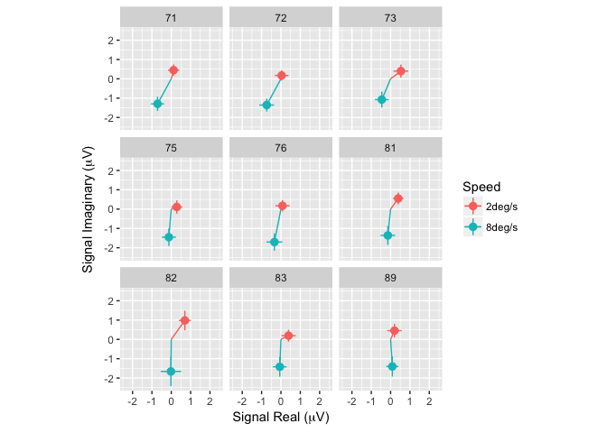
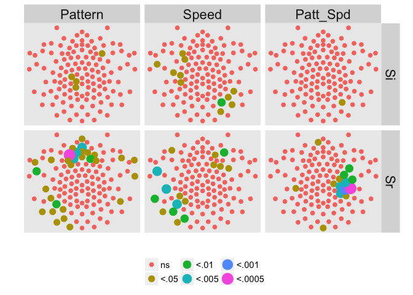

```{r setup, include=FALSE}
knitr::opts_chunk$set(echo = TRUE)
```

## Submission instructions from <https://infantstudies.org/abstracts/>

Three dedicated poster sessions will be available during the congress for individual, free-standing research presentations.  Posters are the appropriate format when material can be explained briefly, is suited for graphic or visual presentation, and/or the presenter would benefit from high levels of interaction and discussion.

### Submission Process

- Include all authors (primary and secondary) exactly as you wish them to appear on published material and in the correct order
- Include an abstract (max 3500 characters – 500 words)
- Prepare an abstract title (max 130 character limit)
- Submit the abstract via ICIS’s online abstract management system. Please note, when submitting the abstract cut and paste it from a text editor (i.e. notepad, wordpad) to ensure it does not include underlying formatting that may cause errors. Do not copy/paste from a Word document as additional hidden formatting could be inserted into the submission.
- Ensure the submission has been approved by all authors

Graphics are encouraged but not required. They do not count toward the maximum word count for the submission.  The two graphics allowed may be:

- 2 tables, or
- 2 figures, or
- 1 table plus 1 figure

Please note that all graphics must be incorporated into one single file.  The file must be in Adobe PDF Format and you will upload the document at the end of the submission process.  If you submit anything other than a pdf document, it will not be viewable.

*By submitting an abstract, you agree to present at the ICIS Meeting should your abstract be selected for the program.

## Authors

Rick O. Gilmore
Andrea R. Seisler
Alyssa A. Pandos
Amanda L. Elam

## Funding

[NSF 1238599](http://www.nsf.gov/awardsearch/showAward?AWD_ID=1238599)

## Title

Infant brain responses differentiate between optic flow patterns and motion speeds

## Abstract (500 words)

Optic flow informs infants' perception of the geometry, speed, and motion of objects in their environment and their own movements through space.
Prior research suggests that infants show larger amplitude electroencephalographic (EEG) responses to direction-reversing linear patterns of optic flow (Gilmore et al., 2007). 
Infants also show larger EEG responses to coherence-modulating radial flow patterns when the motion speeds are faster (Hou et al., 2009). 
<!-- Behavioral studies in nonhuman primates indicate that infant monkeys show an early sensitivity to fast linear motion (Kiorpes & Movshon, 2004). -->
<!-- Computational analyses suggest that fast linear optic flow is common in infants' natural environments (Gilmore et al., 2015).  -->
Moreover, human children 4-8 years old show larger amplitude EEG responses to fast radial and rotational optic flow (Gilmore, Thomas & Fesi, 2016), suggesting that the motion processing network undergoes prolonged development throughout childhood.

To provide a direct comparison with prior child neural data, high density (128 channel) EEG responses were recorded from (n=23; 13 female) 17- to 38-week-old infants who viewed two different patterns (radial and linear) of optic flow presented at two different speeds (2 and 8 deg/s). 
Flow patterns were generated from white dots moving on a black background, with the degree of motion coherence varying from 100% (coherent) to 0% (incoherent/random) every 833 ms, resulting in a first harmonic (1F1) of 1.2 Hz. 
The EEG data were cleaned and filtered before being subjected to a frequency domain analysis using a discrete Fourier transform. 
This analysis provided data about complex domain responses to the optic flow stimulus at low-order integer harmonics of the coherence modulating frequency (e.g., 1F1, 2F1, 3F1).

At the first harmonic (1F1; 1.2 Hz), infants showed a small cluster of left frontal channels that showed higher amplitude responses to translational patterns and a larger cluster over the posterior midline that showed higher amplitude and distinct phase responses to faster speeds.
At the second harmonic (2F1; 2.4 Hz), there was a cluster of left frontal channels that showed higher amplitudes to radial motion, a group of left lateral channels that showed higher amplitudes to faster speeds, and a right lateral cluster that showed a pattern by speed interaction. 
Results from the third harmonic (3F1; 3.6 Hz) showed a small left frontal cluster of channels with higher responses to radial motion and two left and right central clusters where EEG phases, amplitudes, or both distinguished between the two speed conditions.

Taken together, the results show that infant brain responses to coherence-modulating optic flow differ both from prior EEG results using direction-changing optic flows (Gilmore et al., 2007) and from those recorded in older children using identical displays (Gilmore, et al., 2016).
Faster (8 deg/s vs. 2 deg/s) speeds tend to evoke larger amplitude EEG responses, consistent with predictions, but radial flows activated larger amplitude responses than linear flows, in contrast with predictions. 
Moreover, the spatial pattern of channels showing speed or pattern sensitivity differs between infants, children, and adults. 
The network of brain systems that detect and respond to optic flow may undergo patterns of development that are more idiosyncratic or individual-specific and less systematic than indicated by previous findings. 

## Figures

<div class="centered">
1F1 Responses to Slow and Fast Speeds</br>

</div>

<div class="centered">
2F1 Responses By Channel</br>

</div>
