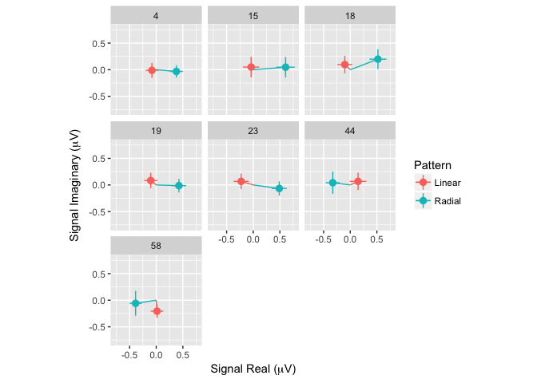

```{r setup, include=FALSE}
knitr::opts_chunk$set(echo = TRUE)
```

<div class="centered">
Fig 1: 1F1 Responses to Slow and Fast Speeds</br>

</div>

<div class="centered">
Fig 2: 2F1 Responses to Linear and Radial Patterns</br>

</div>
