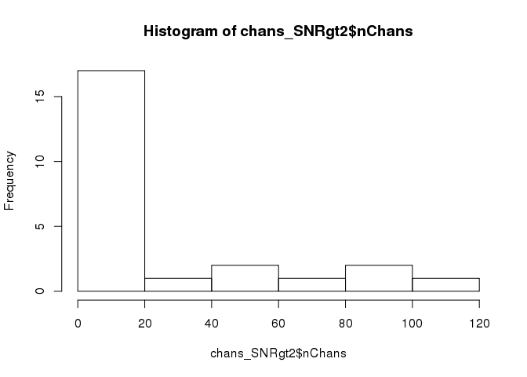
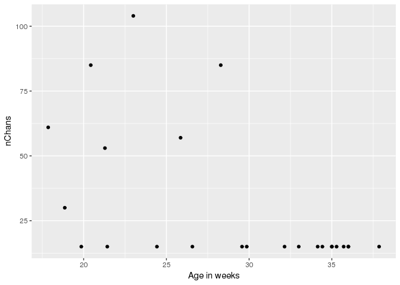

infant-moco
================
Rick Gilmore & Alyssa Pandos & Andrea Seisler
2017-11-03 11:45:13

Introduction
------------

Methods and Materials
---------------------

### Participants

Twenty-four infants, (13 female; mean age: 27.8 weeks; range 17.9-37.9 weeks) participated in the study. The sample consisted of infants drawn from a database of families in Centre County, Pennsylvania. Infants were excluded if they were born prematurely, had a history of serious visual or medical problems, epilepsy, or seizures. All infants tested had normal pattern vision as evaluated with Teller Acuity Cards, a measure of visual function designed for non-verbal participants. We obtained written consent to participate from parents or guardians on behalf of the infants under procedures approved by the Institutional Review Board of The Pennsylvania State University (\#37946). The research was conducted according to the principles expressed in the Declaration of Helsinki.

### Stimuli

Participants viewed limited lifetime random-dot kinematograms generated by a Macintosh G4 computer using PowerDiva Video software (version 3.4, Smith-Kettlewell Eye Research Institute) connected to a monochrome Mitsubishi Std Diamondtron 2060u monitor with an 800 x 600 pixel resolution and a refresh rate of 72 Hz. All patterns were displayed in an annular region 24 deg in outer and 4.8 deg inner diameter at the 60 cm viewing distance. The display consisted of white (**81.2** cd/m2) dots on a black (**0.5** cd/m2) background. Dots were 7 arc min (.12 deg) in diameter and plotted at a density of **7.35 dot/deg2**. The displays alternated between globally coherent (100% coherent) and globally incoherent (0% coherent) motion every 417 ms. A complete on/off cycle lasted 833 ms, for a fundamental frequency (1F1) of 1.2 Hz. The frame rate for updating dot positions was 24 Hz (1F2); **dot positions were updated every 3 screen refresh cycles. During incoherent motion, the range of possible dot directions on each update cycle was 360 deg. During coherent motion dot directions on each update were specified by the type of global motion pattern condition. ** Two types of global motion patterns were displayed -- left and right translation, and radial expansion and contraction. In order to reduce response adaptation, the direction of motion reversed every other cycle (**at 0.6 Hz**). Each pattern was shown at two speeds: 2, and 8 deg/s, forming a total of four conditions. Dot speeds in both the incoherent and coherent phases within a motion speed condition were identical. Each trial consisted of 10 cycles of coherent/incoherent motion. Three to five trials per condition were collected contingent on the length of time that the infant was quiet and attentive in a single laboratory testing session. **The maximum dot lifetime was 100 dot updates (4.17s); 1% of the dots were repositioned on each update on a fixed schedule. The relatively long dot maximum lifetime was used to reduce low frequency luminance artifacts that can result from more frequent dot repositioning.**

<!-- Insert figure of displays -->
### Procedures

Upon arrival at the laboratory, study and visit procedures were described and informed consent was obtained. Visual acuity was measured for each participant with the Teller Acuity cards. After net fitting participants were escorted to the testing room with their parent and seated on an adjustable chair on their parents lap in front of the computer monitor. After net placement, electrode impedances were checked. When impedances met testing criteria (at 50kΩ or below), lights were dimmed and the session began. The experimenter remained in the testing room to attract the infant's attention to the stimuli with small toys in the center of the display. If the infant was not attending, that section of EEG waveform was marked so it was not utilized during the post processing procedures. The entire testing session took about 45 min.

### EEG Collection

A 128-channel HydroCel Geodesic Sensor Net (Electrical Geodesics, Inc.) was used in conjunction with NetStation 4.1 software to record SSVEP responses to the stimuli. EEG was sampled rate of **432.43 Hz**, referenced to Cz, and the signal was low-pass filtered at 50 Hz \[ref(70)\] prior to analysis. Amplitude modulations that exceeded 200µV were rejected as artifact. Trials that had 15% of coherent/incoherent cycles rejected by these criteria were excluded from analysis. Infants who produced fewer than three trials per condition were also excluded. A total of 12 children were excluded from analysis; 1 was excluded due to too few trials, 2 refused to wear the EEG net, 4 post processing errors, and 5 others were excluded due to equipment malfunction. In total, 17 children were included in the analysis (mean age=X months; SD=X).

Results
-------

``` r
# SNR analysis
moco_merged %>%
  select(iSess, SNR) %>%
  mutate(SNRgt2 = (SNR > 2)) %>%
  filter(SNRgt2 == TRUE) %>%
  group_by(iSess) %>%
  summarize(nChans = n()) ->
  chans_SNRgt2
chans_SNRgt2
```

    ## # A tibble: 24 x 2
    ##    iSess nChans
    ##    <int>  <int>
    ##  1  1003     15
    ##  2  1015     15
    ##  3  1019     15
    ##  4  1023     15
    ##  5  1038     15
    ##  6  1044     15
    ##  7  1047     15
    ##  8  1049     15
    ##  9  1051     15
    ## 10  1052     15
    ## # ... with 14 more rows

``` r
hist(chans_SNRgt2$nChans)
```



``` r
moco_merged %>%
  select(iSess, DayAge, SNR) %>%
  mutate(SNRgt2 = (SNR > 2)) %>%
  filter(SNRgt2 == TRUE) %>%
  group_by(iSess, DayAge) %>%
  summarize(nChans = n()) %>%
  ggplot() +
  aes(DayAge/7, nChans) +
  geom_point() +
  xlab("Age in weeks")
```



Odd that the older infants have the same (n=15) channels that meet the SNR &gt; 2 threshold.

``` r
# conds 1-4:
# radial, radial, linear, linear
# slow, fast, slow, fast (5 arcmin/update; 20 arcmin/update; 2deg/s; 8deg/s)

moco_merged$Speed <- NA
moco_merged$Speed[moco_merged$iCond == 1] <- "2deg/s"
moco_merged$Speed[moco_merged$iCond == 3] <- "2deg/s"
moco_merged$Speed[moco_merged$iCond == 2] <- "8deg/s"
moco_merged$Speed[moco_merged$iCond == 4] <- "8deg/s"

moco_merged$Pattern <- NA
moco_merged$Pattern[moco_merged$iCond == 1] <- "Radial"
moco_merged$Pattern[moco_merged$iCond == 2] <- "Radial"
moco_merged$Pattern[moco_merged$iCond == 3] <- "Linear"
moco_merged$Pattern[moco_merged$iCond == 4] <- "Linear"
names(moco_merged)[4] <- "Channel"

# See if compute_t2_circ runs
#compute_t2_circ(100, moco_merged, "2F1", "Radial", "2deg/s")
#NaN NaN   2  -4
# Gives odd results so check carefully.

# Can we plot a scatterplot with Sr, Si and one point for each participant, given a condition in the study (Pattern, Speed combo) at a harmonic and a channel.

# Look at conditions for iSess = 1098
moco_merged %>%
  filter(iSess != 1098) ->
  moco_merged
```
